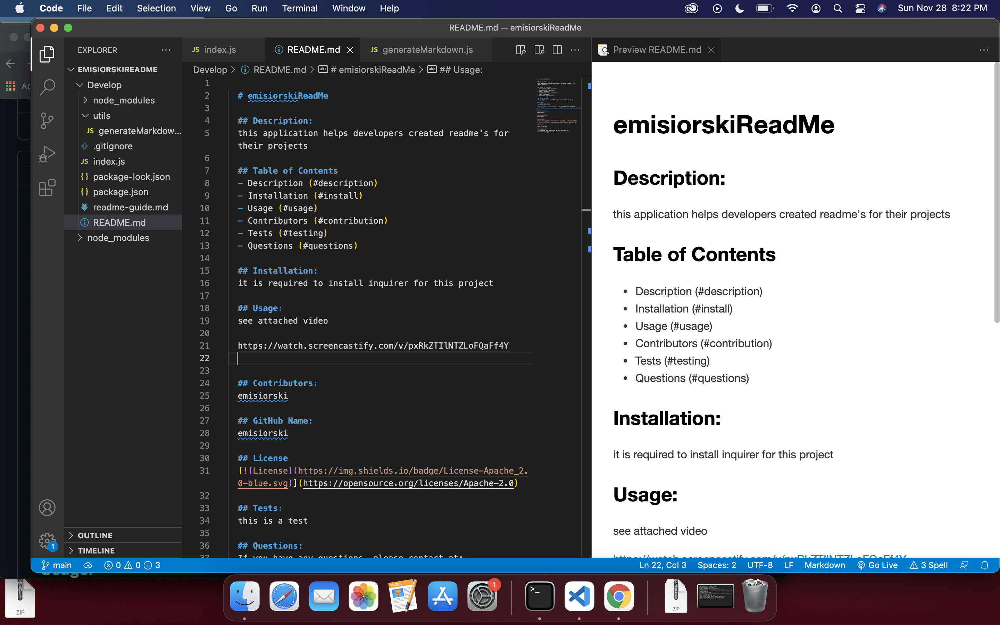

  # emisiorskiReadMe

  ## Description:
  this application helps developers created readme's for their projects

  ## Table of Contents
  - Description (#description)
  - Installation (#install)
  - Usage (#usage)
  - Contributors (#contribution)
  - Tests (#testing)
  - Questions (#questions)

  ## Installation:
  it is required to install inquirer for this project

  ## Usage:
  see attached video

  https://watch.screencastify.com/v/pxRkZTIlNTZLoFQaFf4Y

  

  ## Contributors:
  emisiorski

  ## GitHub Name:
  emisiorski

  ## License
  

  ## Tests:
  this is a test

  ## Questions:
  If you have any questions, please contact at: 
  ericamisiorski@gmail.com

